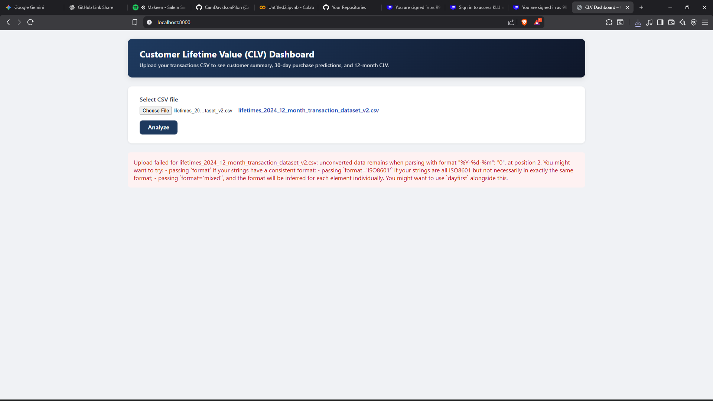
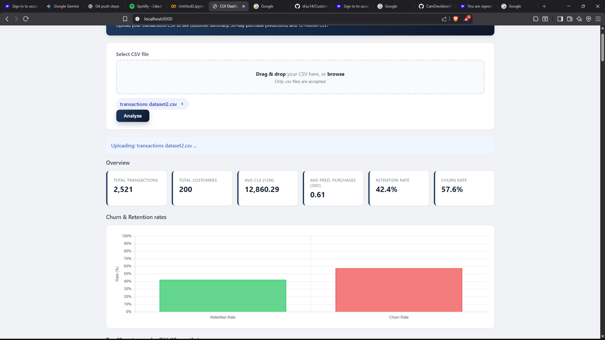
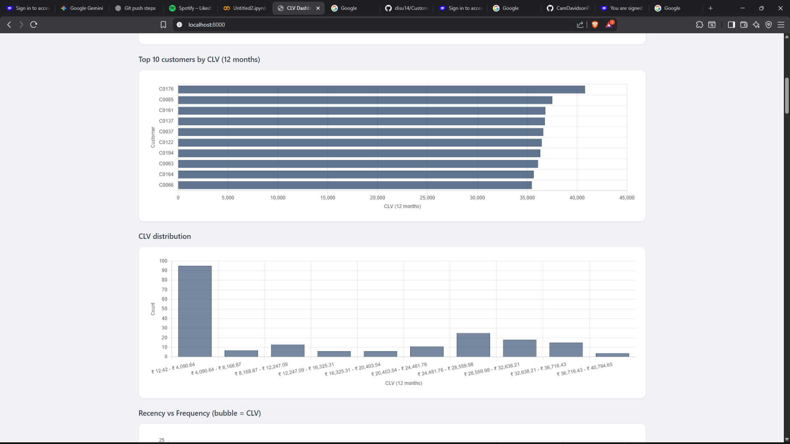
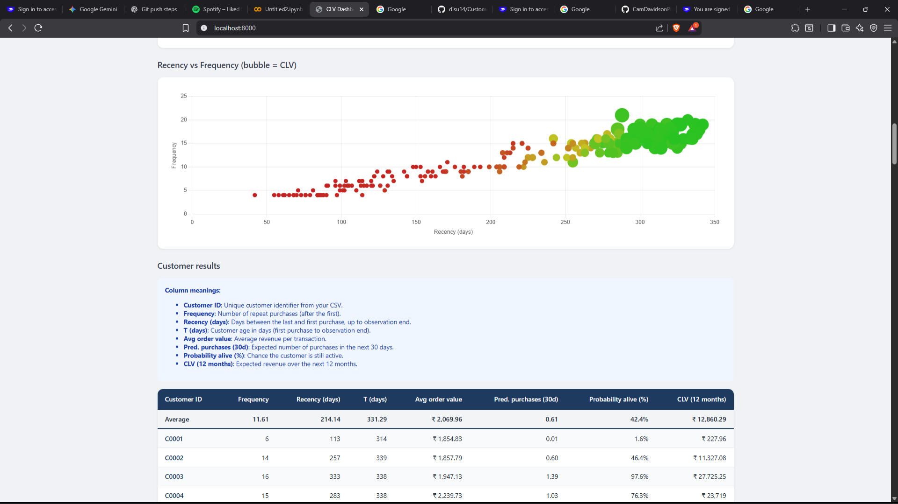

# Customer Lifetime Value (CLV) Dashboard

A web-based **Customer Lifetime Value** estimation tool built with Python. Upload your transaction CSV and get instant insights — predicted purchases, retention/churn rates, CLV rankings, and interactive charts.

## Features

- **CSV upload** — drag & drop or select a transactions file
- **RFM analysis** — frequency, recency, customer age (T), avg order value
- **30-day purchase predictions** — BG/NBD model
- **12-month CLV** — Gamma-Gamma monetary model
- **Retention & churn rates** — probability alive per customer
- **Interactive charts** — top customers, CLV distribution, recency vs frequency bubble chart
- **Customer results table** — sortable per-customer metrics

## Screenshots

### 1. Upload CSV & Analyze

Select your transactions CSV file and click **Analyze** to run CLV prediction.



### 2. Overview — Key Metrics & Churn/Retention

View total transactions, customers, average CLV, predicted purchases, retention rate, and churn rate with a visual chart.



### 3. Charts — Top Customers & CLV Distribution

See top 10 customers by 12-month CLV and the overall CLV distribution across all customers.



### 4. Customer Results — Recency vs Frequency & Table

Explore the recency vs frequency bubble chart (bubble size = CLV) and a detailed per-customer results table.



## Project Structure

```
customer-lifetime-value-estimation/
├── assets/
│   └── screenshots/          # Dashboard screenshots for README
├── backend/
│   ├── serve.py              # Stdlib HTTP server (recommended)
│   ├── app.py                # FastAPI backend
│   └── requirements.txt
├── data/
│   ├── transactions.csv      # Default demo dataset (200 customers)
│   └── sample/
│       ├── transactions-iso-dates.csv    # ISO date format (YYYY-MM-DD)
│       ├── transactions-ddmmyyyy.csv   # DD-MM-YYYY date format
│       └── transactions-large.csv        # Larger sample dataset
├── frontend/
│   └── index.html            # CLV dashboard UI
├── lifetimes/                # Core CLV modeling package
│   ├── fitters/              # BG/NBD, Pareto/NBD, Gamma-Gamma models
│   ├── datasets/             # Built-in sample datasets
│   └── utils.py
├── scripts/
│   └── run_analysis.py       # CLI script to run analysis on data/transactions.csv
├── tests/
├── run_server.bat            # Windows quick-start
├── requirements.txt
└── LICENSE.txt
```

## Quick Start

### 1. Install dependencies

```bash
pip install -r requirements.txt
```

### 2. Start the server

**Option A — Simple (no extra install)**

```bash
python backend/serve.py
```

Or double-click `run_server.bat` on Windows.

**Option B — FastAPI**

```bash
pip install -r backend/requirements.txt
uvicorn backend.app:app --reload
```

### 3. Open the dashboard

Go to **http://localhost:8000** in your browser.

### 4. Upload a CSV

Use one of the sample files from `data/sample/` or your own data.

## CSV Format

Your CSV must have these three columns:

| Column | Description | Example |
|--------|-------------|---------|
| `customer_id` | Unique customer identifier | `C0001` |
| `transaction_date` | Date of purchase | `2024-02-21` or `30-01-2023` |
| `monetary_value` | Revenue per transaction | `1250.50` |

**Supported date formats:** `YYYY-MM-DD` (ISO) and `DD-MM-YYYY`

## Sample Datasets

| File | Customers | Transactions | Date Format |
|------|-----------|--------------|-------------|
| `data/transactions.csv` | 200 | ~2,500 | ISO (`YYYY-MM-DD`) |
| `data/sample/transactions-ddmmyyyy.csv` | ~100 | ~1,600 | DD-MM-YYYY |
| `data/sample/transactions-large.csv` | ~200 | ~2,800 | DD-MM-YYYY |

## How It Works

This project uses **"Buy 'Til You Die"** probabilistic models:

1. **BG/NBD (Beta-Geometric / Negative Binomial Distribution)** — predicts how many times a customer will purchase in a given period and estimates if they are still "alive" (active).
2. **Gamma-Gamma** — estimates the average monetary value per transaction and combines with BG/NBD to calculate **Customer Lifetime Value**.

### Output metrics

| Metric | Description |
|--------|-------------|
| Frequency | Number of repeat purchases |
| Recency | Days between first and last purchase |
| T (days) | Customer age since first purchase |
| Pred. purchases (30d) | Expected purchases in next 30 days |
| Probability alive (%) | Chance customer is still active |
| CLV (12 months) | Expected revenue over next 12 months |

## CLI Analysis (without browser)

```bash
python scripts/run_analysis.py
```

Runs analysis on `data/transactions.csv` and prints results to the terminal.

## Requirements

- Python 3.8+
- numpy, scipy, pandas, autograd, dill (see `requirements.txt`)
- Optional: FastAPI + uvicorn for Option B

## License

This project includes components derived from the MIT-licensed [lifetimes](https://github.com/CamDavidsonPilon/lifetimes) library. See `LICENSE.txt` for details.

## Author

**Chandragupta Maurya**

## References

- [Lifetimes documentation](http://lifetimes.readthedocs.io/en/latest/)
- Fader, Hardie & Lee — *"Counting Your Customers" the Easy Way*
- Schmittlein, Morrison & Colombo — *Counting Your Customers: Who Are They and What Will They Do Next?*
